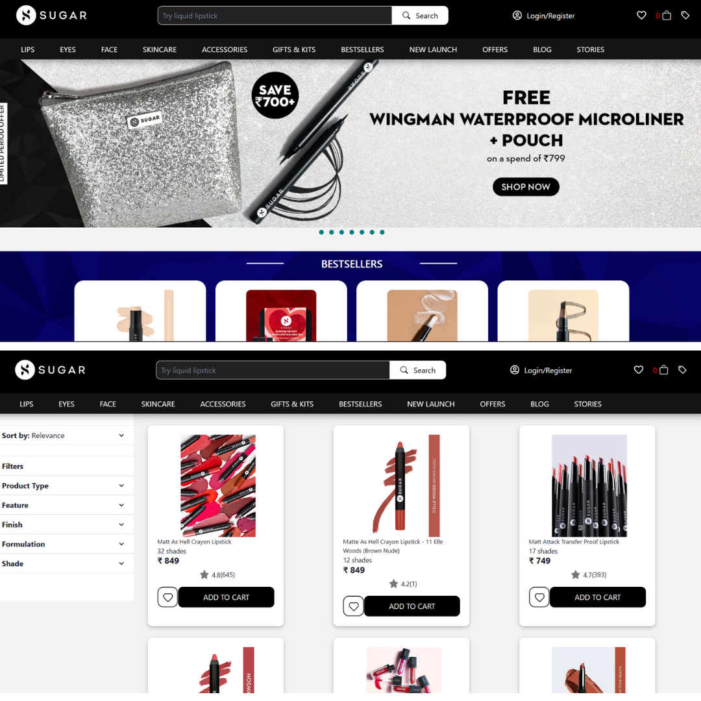
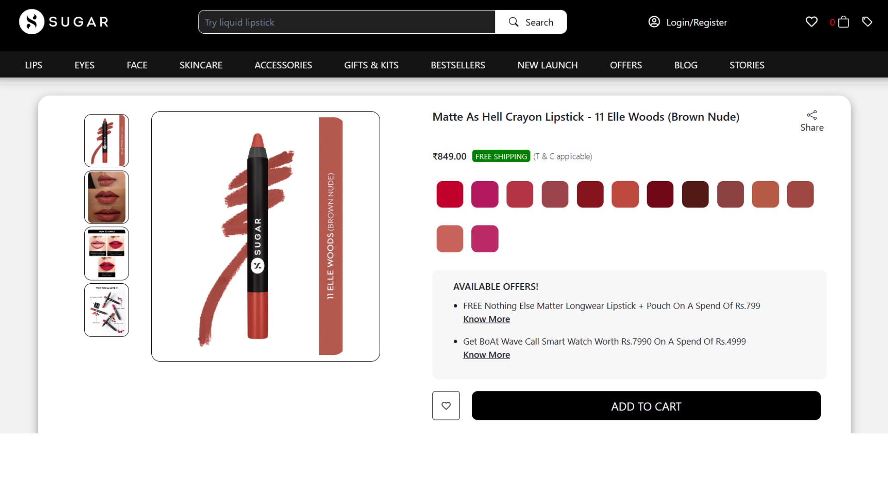
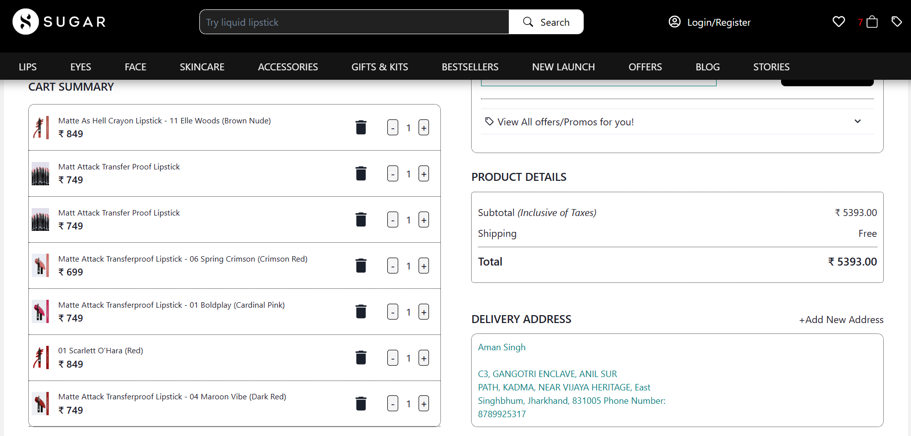

 

<h1 style="display : flex ; justify-content : space-between ; align-items : center " >Sugar Cosmetics Clone - <a href="https://sugar-cosmetics-clone-masai-1.netlify.app/" >Live</a> </h1> 

<h2> About Sugar cosmetics </h2>
Sugar Cosmetics is an aggregator and marketplace for beauty and cosmetics products in India, enabling easy accessibility at affordable prices. 

<h2>Goal</h2>
Our goal was to create a picture perfect replica of Sugar Cosmetics by developing pages that formed the main user path of the website. 
We wanted to captrue the user's actions and flow, right from when the user lands on the home page to when they successfully place their order. 
 
 
<i> <b> User Path followed - </b> </i>
 

 Home page (search products) 

  Product List Page 

  Individual Product Page 
 
 Add to cart 

 Cart 

 Payment 
 
 Order Status (Confirmed/Processing/Rejected) 

<h2>Tech Stack</h2>
React | Redux | HTML | CSS 

<h2> Concepts Utilized</h2>
<ul>
    <li>React</li>
    <li>Redux</li>
    <li>Chakra UI</li>
    <li>Context API</li>
    <li>HTML & CSS</li>
    <li>Mock Server</li>
</ul>

<h2>Pages Implemented</h2>
<ul>
    <li>Home Page</li>
    <li>Product List Page</li>
    <li>Individual Product Page</li>
    <li>Cart</li>
    <li>Payment Page</li>
    <li>Orders Page</li>
    <li>Signup/Login</li>
</ul>

<h2> Project Snapshots </h2>

 1. Landing and Product List PAge 

 2. Individual Product Page

 3. Cart

 
Deployment Link - <a href="https://sugar-cosmetics-clone-masai-1.netlify.app/"> Sugar Cosmetics Clone </a>
 

<h2> Team </h2>
<ul>
<li>Rushikesh Mali  </li>
<li>Aman Singh  </li>
<li>Akshata Ganbote  </li>
<li>Shubham Sharma  </li>
</ul>
  
<h3> Thank you for reading ! :) </h3>

